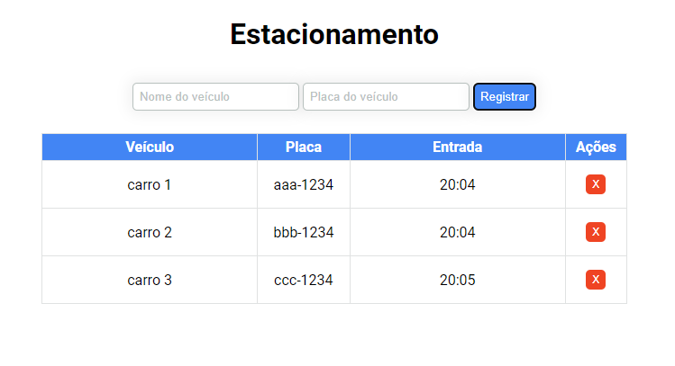
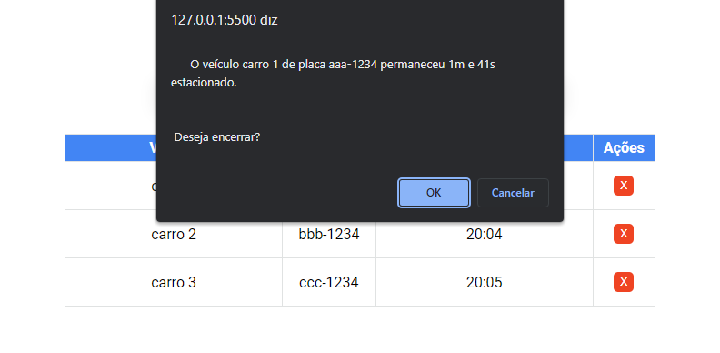

<h1 align="center">Estacionamento</h1>

## Descrição do Projeto

Projeto desenvolvido no bootcamp da <a href="https://dio.me/">DIO</a>, neste projeto aprendemos os conceitos básicos de Typescript.

 

## Como usar

Para executarmos o projeto, basta acessar a pasta public e abrir o arquivo index.html em um navegador de preferência..

 

### 🛠 Tecnologias

As seguintes tecnologias foram usadas na construção do projeto:

 

### Preview

